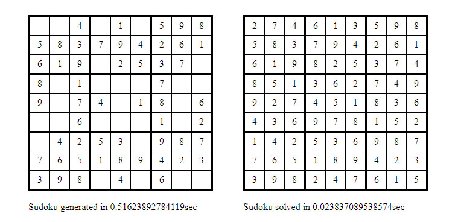

### A semantic sudoku library
A semantic php sudoku library for generating, solving and checking 9x9 sudoku grids.
Generating and solving sudokus is done using Donald Knuth's algorithm X along with his 
suggested implementation "the dancing links".

A screenshot of **example.php**:


**Quick start**

This library contains a wrapper class "Sudoku" for simple case uses to get it
running without a hassle. 
```php
$sudoku = new Sudoku();

//generate an x amount of sudoku boards
$puzzles = $sudoku->generateSudokuPuzzles(1);

//get the solution to a specific sudoku board
$solvedPuzzle = $sudoku->getSolutionToPuzzle($myUnsolvedSudokuPuzzle);
```
However this class hides more advanced options and some functionality. To have access
to everything either edit the wrapper class fo fit your needs or use each class
separately.
```php
//has methods like isRowSolved(), isColumnSolved(), getCellCandidates() etc...
$sudokuChecker = new SudokuChecker();

//choose how many solutions to find, in determenistic or non-deterministicfashion, check time cost;
$sudokuSolver = new SudokuSolver(new SudokuExactCover(), new DancingLinks());

//generate symmetrical/non-symmetrical x amount of boards, solved/unsolved, generate using a different algorithm;
$sudokuGenerator = new SudokuGenerator($sudokuChecker, $sudokuSolver);
```

**Ideas for improvements**

- Add a grader class to grade sudoku difficulty and hook it up to the generator to generate boards based on difficulty.
- Store the binary constraint matrix for a completely empty sudoku grid in a file and just load it up, since it never changes.
- Optimize creation of the linked list.
- Generate new boards with the first row already filled in with a ranndom permutation, to get a small efficiency boost.

**References**

[Donald Knuth's paper "Dancing Links"](https://arxiv.org/abs/cs/0011047)

[Gareth Rees article "Zendoku puzzle generator"](http://garethrees.org/2007/06/10/zendoku-generation/)

**License**

MIT